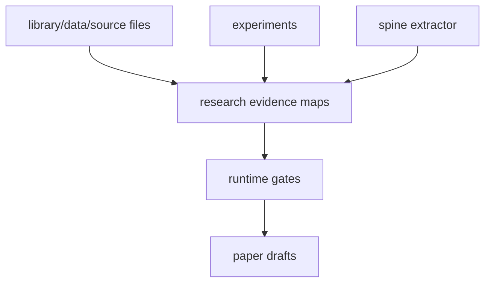
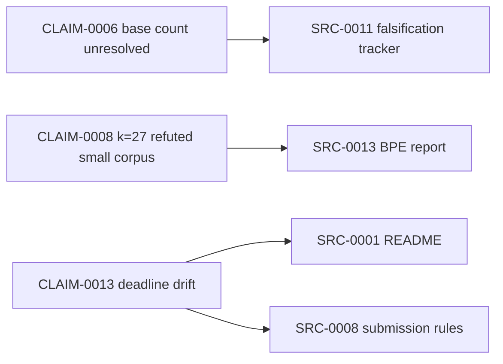
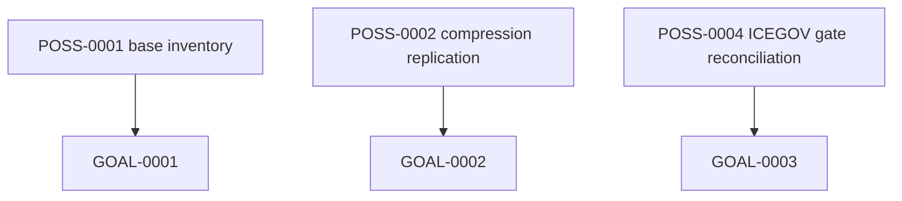
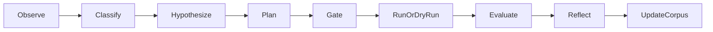

# Mermaid Maps

## Repo Architecture

```mermaid
flowchart TD
  A["library/data/source files"] --> B["research evidence maps"]
  B --> C["runtime gates"]
  C --> D["paper drafts"]
  E["experiments"] --> B
  F["spine extractor"] --> B
```

## Claim-Evidence Graph

```mermaid
flowchart LR
  C6["CLAIM-0006 base count unresolved"] --> S11["SRC-0011 falsification tracker"]
  C8["CLAIM-0008 k=27 refuted small corpus"] --> S13["SRC-0013 BPE report"]
  C13["CLAIM-0013 deadline drift"] --> S1["SRC-0001 README"]
  C13 --> S8["SRC-0008 submission rules"]
```

## Research Goal Dependency Graph

```mermaid
flowchart TD
  P1["POSS-0001 base inventory"] --> G1["GOAL-0001"]
  P2["POSS-0002 compression replication"] --> G2["GOAL-0002"]
  P4["POSS-0004 ICEGOV gate reconciliation"] --> G3["GOAL-0003"]
```

## Experiment Pipeline

```mermaid
flowchart LR
  Observe --> Classify --> Hypothesize --> Plan --> Gate --> RunOrDryRun --> Evaluate --> Reflect --> UpdateCorpus
```
