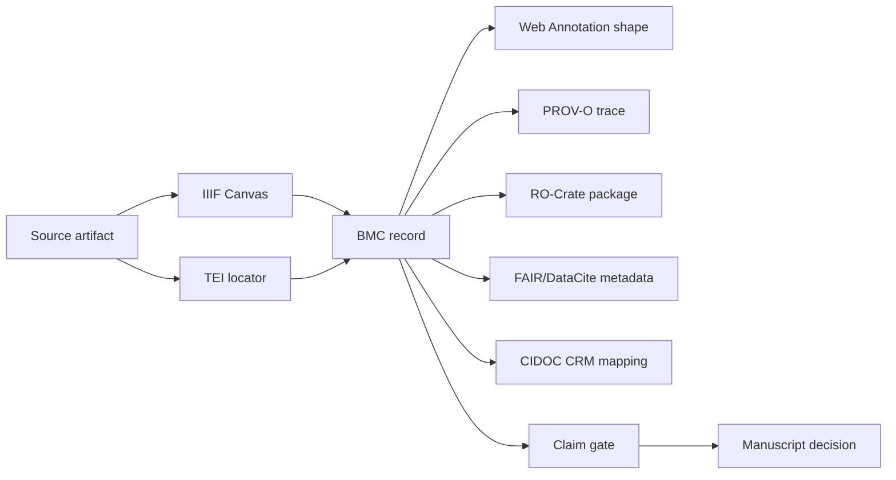

# BMC Standard Mapping Graph

```mermaid
graph LR
  Source["Source artifact"] --> IIIF["IIIF Canvas"]
  Source --> TEI["TEI locator"]
  IIIF --> BMC["BMC record"]
  TEI --> BMC
  BMC --> WA["Web Annotation shape"]
  BMC --> PROV["PROV-O trace"]
  BMC --> RO["RO-Crate package"]
  BMC --> FAIR["FAIR/DataCite metadata"]
  BMC --> CIDOC["CIDOC CRM mapping"]
  BMC --> Gate["Claim gate"]
  Gate --> Paper["Manuscript decision"]
```
