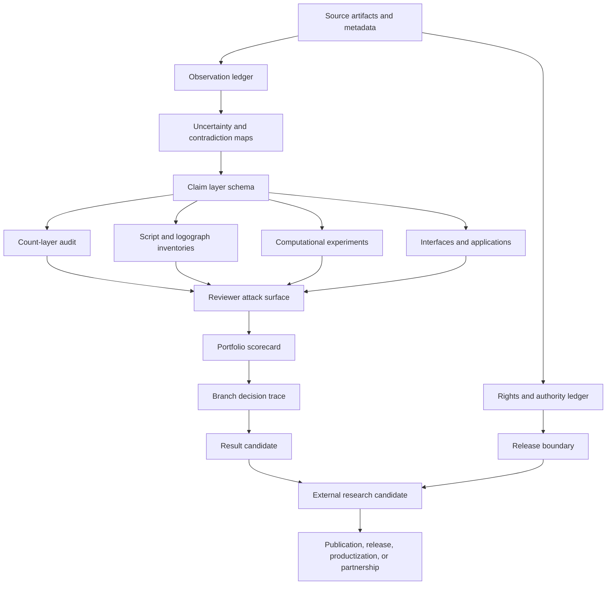
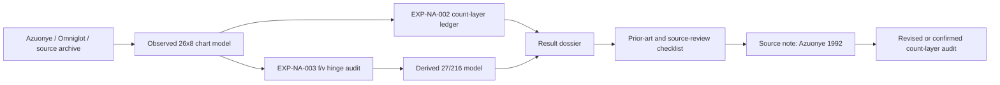
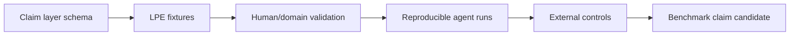
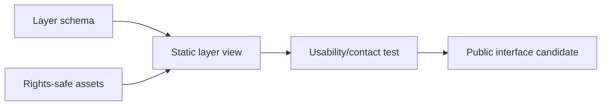

# Frontier Dependency Graph

## Purpose

This graph shows how sources, claims, datasets, scripts, experiments, products,
reviews, rights, and publications depend on one another. It is designed to keep
the frontier broad while preventing immature branches from looking ready.

## High-Level Graph

## Critical Dependencies

| Output | Depends on | Blocks if missing |
|---|---|---|
| Source-facing claim | Source locator, extraction method, uncertainty record | Artifact-specific public claim |
| Derived count claim | Source input, transformation rule, derivation path | 27/216 language |
| Public image/table release | Rights status, authority review, attribution boundary | Public release or exhibition |
| LPE benchmark claim | Validated labels, external controls, reproducible runs | Frontier AI-eval claim |
| Unicode-readiness claim | Repertoire evidence, source status, authority review | Standards/proposal language |
| Product/design claim | Source-to-abstraction lineage, application-layer label, rights review | Public product/demo claim |
| Paper-candidate branch | Result dossier, prior art, reviewer attack surface, validators | Draft hardening or readiness language |

## Current Branch Dependencies

### `EXP-NA-002` Count-Layer Audit

Current blocker: source note and human/domain review.

### LPE / Agent Evaluation

Current blocker: validation and external controls.

### Interface / Public Legibility

Current blocker: rights-safe asset boundary and contact test.

## No-Shortcut Rules

- A manuscript draft does not satisfy source review.
- A benchmark score does not satisfy human/domain validation.
- A compiled PDF does not satisfy rights or authority review.
- A useful prototype does not prove a historical claim.
- A striking analogy does not prove a mechanism.
- A standards mapping does not prove compliance or readiness.

## Next Graph Update

Update this graph after the first parallel exploration sprint selects and
records Track A, Track B, and Track C artifacts.
