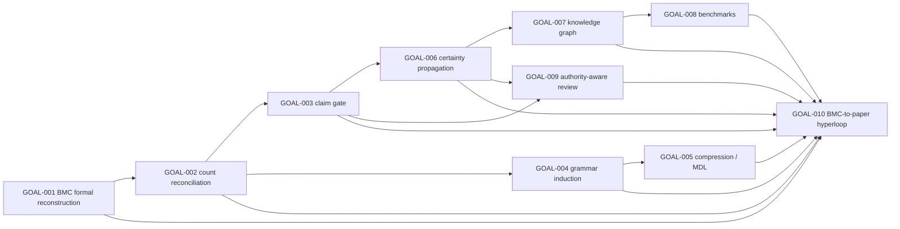

# BMC Goal Dependency Graph

## Activation Rule

Activate only GOAL-001, GOAL-002, and GOAL-003 now. Do not activate GOAL-004 or GOAL-005 until GOAL-002 confirms stable count layers. Do not activate GOAL-010 until the claim gate has approved or blocked core claims.
